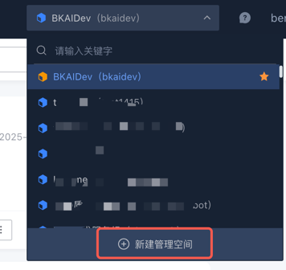
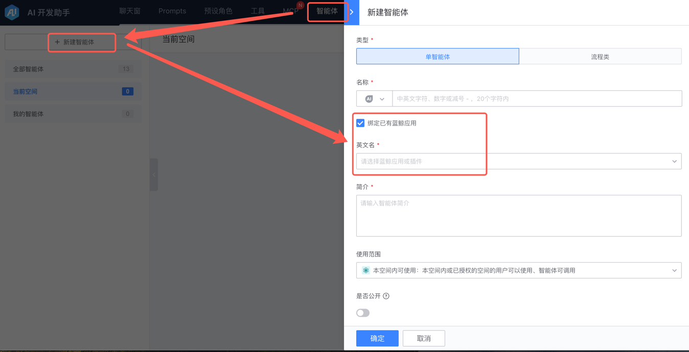
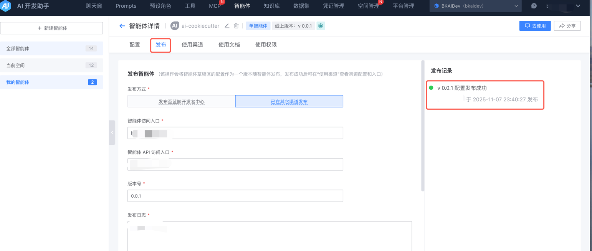
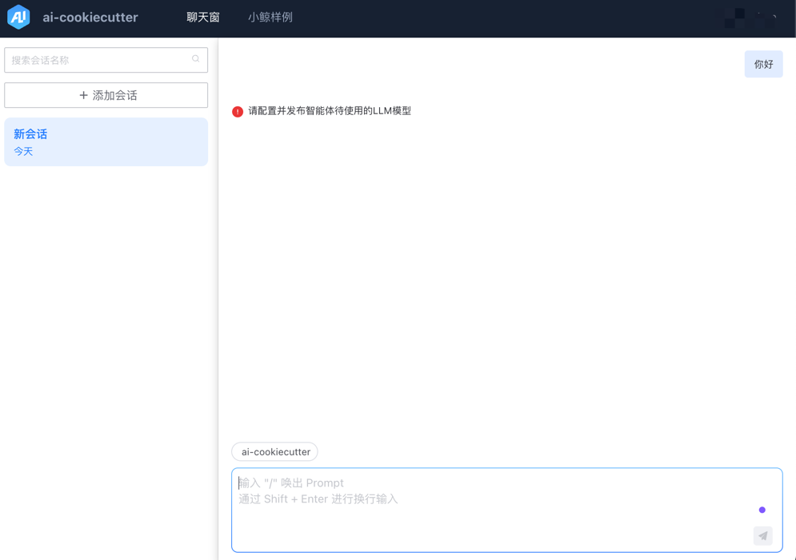

# AIDev 智能体开发常见问题

## 本地环境部署

<hr/>

### ❓问题：no such table: account_user
```text
OperationalError at /
no such table: account_user
```
#### 原因
数据库未完成初始化，缺少必要的数据表结构。

#### 解决方案
执行以下命令完成数据库迁移：
```shell
source .env
source .venv/bin/activate
python bin/manage.py migrate
```

<hr/>

### ❓问题：智能体关联失败
使用智能体(ai-xxx)前，需要先将其关联至 [AI 开发助手] 空间

#### 原因
如果您是直接从开发者中心创建的 AI 智能体插件，在使用前必须先将其关联到特定的项目空间。

#### 解决方案
1. 选择或创建一个智能体专属的项目空间



2. 将智能体绑定至项目空间（注意：从开发者中心创建的智能体只能关联到原先指定的空间）



3. 完成关联后，请务必配置并发布智能体



<hr/>

### ❓问题：no such table: my_cache_table

#### 原因
本地环境中缺少 Django 缓存所需的数据表。

#### 解决方案
执行以下命令创建缓存表：
```shell
source .env
source .venv/bin/activate
python bin/manage.py createcachetable
```

<hr/>

### ❓问题：智能体发布失败

在聊天窗口会话时出现提示：请配置并发布智能体待使用的LLM模型  



#### 原因
智能体尚未完成发布流程，或者未配置所需的本地模型。

#### 解决方案
请完成智能体的配置并执行发布操作：


<hr/>

### ❓问题：Token超限报错

在聊天窗口会话时出现Token超限的相关提示：


#### 原因
目前默认上下文最大token数只有28000，超过了这个最大限制会按（压缩知识库召回内容➡压缩工具调用结果➡抛除chat history内容）优先级去压缩上下文，如果还是超限，就会报调用异常的提示。

#### 解决方案
可通过修改 LLM_TOKEN_LIMIT 环境变量的值来调整最大token限制数，后续需开发同学支持提供部署模型支持的token长度的配置表，并通过查表自动适配模型对应token长度。

   修改方式：
* 本地二次开发：在.env文件中新增 export LLM_TOKEN_LIMIT=xxx，再重新执行 source .env 即可。
* 平台智能体：在蓝鲸开发者中心的模块配置中新增环境变量 LLM_TOKEN_LIMIT，完成配置后重新部署。


