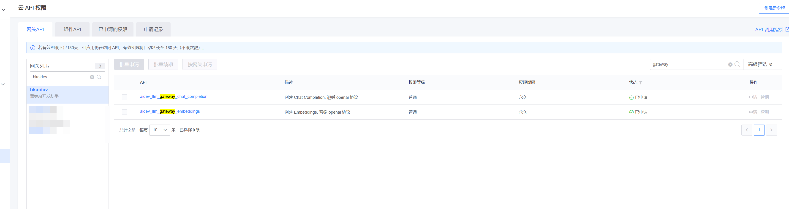
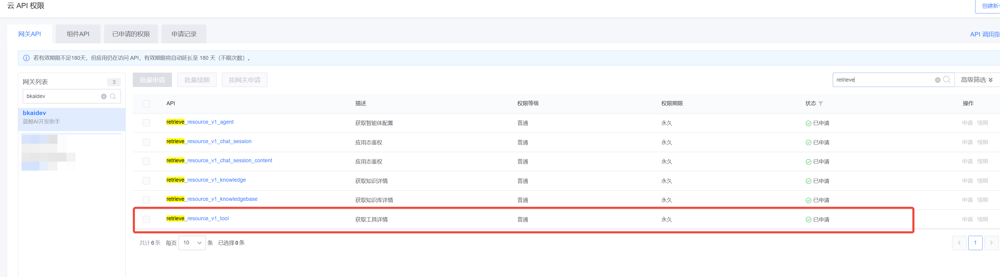
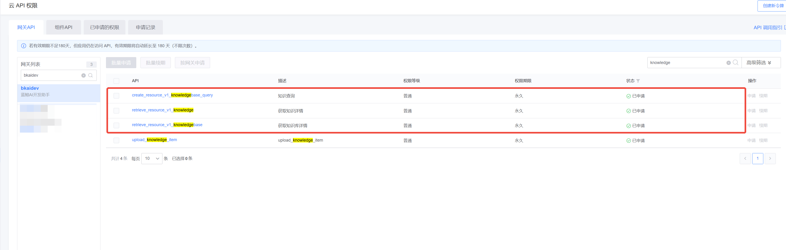

# aidev-agent sdk使用指南

## 概览

**当前版本**：1.0.0b9

### 支持的能力：

- 通用 Agent：支持基于任意模型进行知识抽取，工具执行，利用添加的工具和知识完成特定任务。
- 通用 Tool/FunctionCallAgent：在上述基础上，对支持 FunctionCall 的模型提供最佳支持。支持最新的 OpenAI Multi Tool 规范，可并发执行
  Function Call。

## 使用入门

### 1. 安装依赖

系统版本：Linux,MacOS
Python版本：>=3.10;

```
$ pip install aidev-agent==1.0.0b9
```

### 2. 使用样例

#### 2.1 使用前配置

使用前需要配置的一些环境变量,可以将下面配置写到`.env`中,下面是一些示例

```
# (必选)以下环境变量可以向aidev的服务的管理员获取
LLM_GW_ENDPOINT=https://xxx.example.com/prod/openapi/aidev/gateway/llm/v1
# 个人拥有的蓝鲸app应用名
APP_ID=xxx
BKPAAS_APP_ID=xxx
# 个人拥有的蓝鲸app应用密钥
APP_TOKEN=yyy
BKPAAS_APP_SECRET=yyy

# (可选)如果需要访问aidev平台资源,如知识库/工具,需要配置下面的环境变量
# 当前可访问的蓝鲸网关的模板名,可以在蓝鲸开发者平台中获取
BK_API_URL_TMPL=http://{api_name}.xxx.com
```

另外,至少需要申请以下`bkaidev`网关的权限,以访问`LLM Gateway`,参考下图



#### 样例1：调用 LLM Gateway 大模型服务

```python
from aidev_agent.core.extend.models.llm_gateway import ChatModel
model = ChatModel.get_setup_instance(model="hunyuan")
result = model.invoke("hi")
print(result)
```

#### 样例2：使用 CommonAgent 调用aidev平台上的工具

**注意** 使用前需要配置以下环境变量

```
# 当前可访问的蓝鲸网关的模板名,可以在蓝鲸开发者平台中获取,下面是示例
BK_API_URL_TMPL=http://{api_name}.xxx.com
```

另外,至少还需要申请下面的网关权限，才能完成样例



代码示例如下:

```python
from aidev_agent.api.bk_aidev import BKAidevApi
from aidev_agent.core.extend.agent.qa import CommonQAAgent
from aidev_agent.core.extend.models.llm_gateway import ChatModel

model_name = "hunyuan"
chat_model = ChatModel.get_setup_instance(
    model=model_name,
    streaming=True,
)

# 获取客户端对象
client = BKAidevApi.get_client_by_username(username="")
# 设置工具,使用aidev平台上的工具的 code
tool_codes = ["weather-query"]
tools = [client.construct_tool(tool_code) for tool_code in tool_codes]

agent_e, cfg = CommonQAAgent.get_agent_executor(
    chat_model,
    chat_model,
    extra_tools=tools,
)

# 测试部分
test_case_inputs = {"input": "今天深圳天气如何?"}
for each in agent_e.agent.stream_standard_event(agent_e, cfg, test_case_inputs):
    print(each)
```


#### 样例3：使用 CommonAgent 调用aidev平台的知识库

**注意** 使用前需要配置以下环境变量

```
# 当前可访问的蓝鲸网关的模板名,可以在蓝鲸开发者平台中获取,下面是示例
BK_API_URL_TMPL=http://{api_name}.xxx.com
```

另外,至少还需要申请下面的网关权限，才能完成样例



代码示例如下:

```python
from aidev_agent.api.bk_aidev import BKAidevApi
from aidev_agent.core.extend.agent.qa import CommonQAAgent
from aidev_agent.core.extend.models.llm_gateway import ChatModel

# 初始化模型和客户端
model_name = "hunyuan"
chat_model = ChatModel.get_setup_instance(
    model=model_name,
    streaming=True,
)
client = BKAidevApi.get_client_by_username(username="")
# 此处填入aidev平台上的知识库的 id
knowledge_bases = [client.api.appspace_retrieve_knowledgebase(path_params={"id": 1})["data"]]

agent_e, cfg = CommonQAAgent.get_agent_executor(
    chat_model,
    chat_model,
)

# 执行测试
test_case_inputs = {"input": "云桌面绿屏怎么办"}
results = []
for each in agent_e.agent.stream_standard_event(agent_e, cfg, test_case_inputs):
    if each == "data: [DONE]\n\n":
        break
    if each:
        chunk = json.loads(each[6:])
        results.append(chunk)

print(results)
```

# SSM客户端使用指南

## 概览

**当前版本**：1.0.0b44

### 支持的能力：

- 应用态和用户态Token管理：获取、刷新、校验access_token
- 自动缓存机制：缓存token，自动处理过期和刷新
- Django集成：从request对象自动提取用户信息和bk_token
- 环境自适应：根据运行环境自动选择SSM端点

⚠️ **重要：SSM 只能直调，不能走网关调用！**

## 使用入门

### 1. 环境变量配置

使用前需要配置环境变量，可以写到`.env`中：

```bash
# (必选) 基础应用配置 - 支持多种环境变量名
APP_ID=your_app_code                # 或 BKPAAS_APP_ID 或 BK_AIDEV_AGENT_APP_CODE
APP_TOKEN=your_app_secret           # 或 BKPAAS_APP_SECRET 或 BK_AIDEV_AGENT_APP_SECRET

# (可选) SSM服务端点配置，不配置会根据RUN_MODE自动选择
BK_SSM_ENDPOINT=                    # 自定义SSM端点（优先级最高）
BK_SSM_SG_ENDPOINT=                 # SG环境（生产）
BK_SSM_BKOP_ENDPOINT=               # BKOP环境（开发）
RUN_MODE=DEVELOPMENT                # PRODUCT 或 DEVELOPMENT（会自动判断）
```

### 2. 使用样例

#### 样例1：获取应用态Token

```python
from aidev_agent.api.ssm_client import SSMClient

client = SSMClient()
access_token = client.get_client_access_token()
print(f"应用态Token: {access_token}")
```

#### 样例2：从Django Request获取用户态Token

```python
from aidev_agent.api.ssm_client import get_user_access_token_from_request

def my_view(request):
    # 快速获取用户态token
    access_token = get_user_access_token_from_request(request)
    return JsonResponse({"access_token": access_token})
```

#### 样例3：主站代码集成

基于主站代码(bkaidev-user)，替换bkoauth获取token：

```python
from aidev_agent.api.ssm_client import get_user_access_token_from_request

class UserView(AIDevAPIViewSet):
    def list(self, request, *args, **kwargs):
        # 替换原来的bkoauth调用
        access_token = get_user_access_token_from_request(request)

        data = {"access_token": access_token}
        return Response(data)
```

#### 样例4：手动提供用户信息

```python
from aidev_agent.api.ssm_client import SSMClient

client = SSMClient()
access_token = client.get_user_access_token(
    username="admin",
    bk_token="user_bk_token_here"
)
```

## API参考

### 常用方法

```python
from aidev_agent.api.ssm_client import SSMClient, get_user_access_token_from_request

# 创建客户端
client = SSMClient()

# 获取应用态token
client.get_client_access_token()

# 获取用户态token
client.get_user_access_token(username="admin", bk_token="token")
client.get_user_access_token(request=request)

# 便捷函数
get_user_access_token_from_request(request)
```


