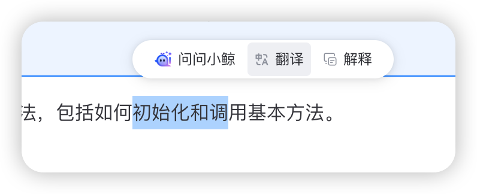

# 内容引用

AI 小鲸支持用户框选内容并通过快捷操作按钮进行交互，提供便捷的内容引用和快速操作能力。

## 内容引用

用户可以通过鼠标选取页面上的文本内容，选中后将自动弹出引用操作菜单，包含配置的快捷操作按钮。



## 启用选中文本弹出菜单

通过设置 `enablePopup` prop 为 `true` (默认值)，用户在页面上选中一段文本后，会自动在选中文本附近弹出一个小图标。点击该图标会展开快捷操作菜单（如果配置了 `shortcuts`）并自动将选中的文本作为引用内容。

```vue
<template>
  <AIBlueking :url="apiUrl" :enable-popup="true" />
</template>

<script setup>
  // 或 <script>
  import AIBlueking from "@blueking/ai-blueking" // 或 /vue2
  import "@blueking/ai-blueking/dist/vue3/style.css" // 或 /vue2
  const apiUrl = "..."
</script>
```

如果设置为 `false`，则不会在选中文本后弹出菜单。

## 控制快捷指令弹窗

在某些情况下，您可能不希望在页面的特定区域选中文字时弹出快捷指令窗口。例如，在一个代码编辑器或者一个具有复杂交互的表格中，这个弹窗可能会干扰正常操作。

AI 小鲸提供了一个简单的方法来禁用特定区域的弹窗功能。您只需要在不希望弹出快捷指令的任何 HTML 元素上添加 `ai-blueking-hide` 属性即可。

```html
<div ai-blueking-hide>
  <p>在这部分区域内选中文本，将不会触发 AI 小鲸的快捷指令弹窗。</p>
  <code>
    // 这里是代码区域，同样不会触发弹窗
    const x = 10;
    console.log(x);
  </code>
</div>
```

当您在带有 `ai-blueking-hide` 属性的元素或其任何子元素中选择文本时，快捷指令弹窗将不会出现。这为您提供了精细的控制能力，确保 AI 小鲸的交互不会干扰您应用中的其他功能。

### 工作原理

AI 小鲸在响应文本选择事件时，会从被选中的文本所在的元素开始，向上遍历DOM树。如果在这个遍历过程中发现了任何一个元素带有 `ai-blueking-hide` 属性，它就会停止处理，从而阻止了弹窗的显示。

这个特性对于提升与现有复杂前端应用的集成体验非常有用。

## 快捷操作配置

内容引用功能与快捷操作紧密结合。用户选中文本后，可以通过快捷操作对选中的内容进行处理。关于快捷操作的详细配置和使用，请参考[快捷操作](./shortcuts.md)文档。

## 快捷操作事件 (shortcut-click)

当用户点击快捷操作按钮时，会触发 `shortcut-click` 事件。您可以监听此事件以执行自定义逻辑。

:::code-group

```vue [Vue 3]
<template>
  <AIBlueking :url="apiUrl" :shortcuts="myShortcuts" @shortcut-click="handleShortcut" />
</template>

<script lang="ts" setup>
  import AIBlueking from "@blueking/ai-blueking"
  import "@blueking/ai-blueking/dist/vue3/style.css"

  const apiUrl = "..."
  const myShortcuts = [
    /* ... */
  ]

  const handleShortcut = (data) => {
    console.log("快捷操作:", data.shortcut.name)
    console.log("表单数据:", data.formData)
    // 可以在这里做一些额外处理，比如打点上报
  }
</script>
```

```vue [Vue 2]
<template>
  <AIBlueking :url="apiUrl" :shortcuts="myShortcuts" @shortcut-click="handleShortcut" />
</template>

<script>
  import AIBlueking from "@blueking/ai-blueking/vue2"
  import "@blueking/ai-blueking/dist/vue2/style.css"

  export default {
    components: { AIBlueking },
    data() {
      return {
        apiUrl: "...",
        myShortcuts: [
          /* ... */
        ],
      }
    },
    methods: {
      handleShortcut(data) {
        console.log("快捷操作:", data.shortcut.name)
        console.log("表单数据:", data.formData)
        // 可以在这里做一些额外处理，比如打点上报
      },
    },
  }
</script>
```

:::

## 编程式触发快捷操作

以下示例展示了如何在代码中触发快捷操作，例如通过点击页面上的按钮：

:::code-group

```vue [Vue 3]
<template>
  <div>
    <!-- 文章内容 -->
    <div class="article">
      <h3>{{ articleTitle }}</h3>
      <p>{{ articleContent }}</p>
    </div>

    <!-- 快捷操作按钮 -->
    <div class="action-buttons">
      <button @click="triggerShortcut('explain', articleTitle)">解释标题</button>
      <button @click="triggerShortcut('translate', articleTitle)">翻译标题</button>
    </div>

    <!-- AI小鲸组件 -->
    <AIBlueking ref="aiBlueking" :url="apiUrl" :shortcuts="shortcuts" />
  </div>
</template>

<script lang="ts" setup>
  import { ref } from "vue"
  import AIBlueking from "@blueking/ai-blueking"
  import { IShortcut } from "@blueking/ai-blueking/dist/types"

  const aiBlueking = ref<InstanceType<typeof AIBlueking>>()
  const articleTitle = "AI 技术的发展与应用"
  const articleContent = "人工智能技术在近年来取得了突飞猛进的发展..."

  const shortcuts: IShortcut[] = [
    {
      id: "explain",
      name: "解释",
      components: [{ type: "textarea", key: "text", name: "内容", fillBack: true }],
    },
    {
      id: "translate",
      name: "翻译",
      components: [
        { type: "textarea", key: "text", name: "内容", fillBack: true },
        {
          type: "select",
          key: "targetLang",
          name: "目标语言",
          options: [
            { label: "英文", value: "en" },
            { label: "日文", value: "jp" },
          ],
          default: "en",
        },
      ],
    },
  ]

  // 编程式触发快捷操作
  const triggerShortcut = (id: string, text: string) => {
    if (!aiBlueking.value) return

    // 找到对应ID的快捷操作
    const shortcut = shortcuts.find((s) => s.id === id)
    if (!shortcut) return

    // 显示AI小鲸窗口
    aiBlueking.value.handleShow()

    // 找到需要填充的表单项
    const textComponent = shortcut.components.find((c) => c.fillBack)
    if (textComponent) {
      textComponent.default = text
    }

    // 触发快捷操作
    aiBlueking.value.handleShortcutClick(shortcut)
  }
</script>
```

```vue [Vue 2]
<template>
  <div>
    <!-- 文章内容 -->
    <div class="article">
      <h3>{{ articleTitle }}</h3>
      <p>{{ articleContent }}</p>
    </div>

    <!-- 快捷操作按钮 -->
    <div class="action-buttons">
      <button @click="triggerShortcut('explain', articleTitle)">解释标题</button>
      <button @click="triggerShortcut('translate', articleTitle)">翻译标题</button>
    </div>

    <!-- AI小鲸组件 -->
    <AIBlueking ref="aiBlueking" :url="apiUrl" :shortcuts="shortcuts" />
  </div>
</template>

<script>
  import AIBlueking from "@blueking/ai-blueking/vue2"

  export default {
    components: { AIBlueking },

    data() {
      return {
        apiUrl: "...",
        articleTitle: "AI 技术的发展与应用",
        articleContent: "人工智能技术在近年来取得了突飞猛进的发展...",
        shortcuts: [
          {
            id: "explain",
            name: "解释",
            components: [{ type: "textarea", key: "text", label: "内容", fillBack: true }],
          },
          {
            id: "translate",
            name: "翻译",
            components: [
              { type: "textarea", key: "text", label: "内容", fillBack: true },
              {
                type: "select",
                key: "targetLang",
                name: "目标语言",
                options: [
                  { label: "英文", value: "en" },
                  { label: "日文", value: "jp" },
                ],
                default: "en",
              },
            ],
          },
        ],
      }
    },

    methods: {
      triggerShortcut(id, text) {
        // 找到对应ID的快捷操作
        const shortcut = this.shortcuts.find((s) => s.id === id)
        if (!shortcut) return

        // 显示AI小鲸窗口
        this.$refs.aiBlueking.handleShow()

        // 找到需要填充的表单项
        const textComponent = shortcut.components.find((c) => c.fillBack)
        if (textComponent) {
          textComponent.default = text
        }

        // 触发快捷操作
        this.$refs.aiBlueking.handleShortcutClick(shortcut)
      },
    },
  }
</script>
```

:::

> **注意**: 在v1.1.0版本中，不再推荐使用sendChat方法来模拟快捷操作，应该直接使用组件暴露的handleShortcutClick方法并传入完整的IShortcut对象。